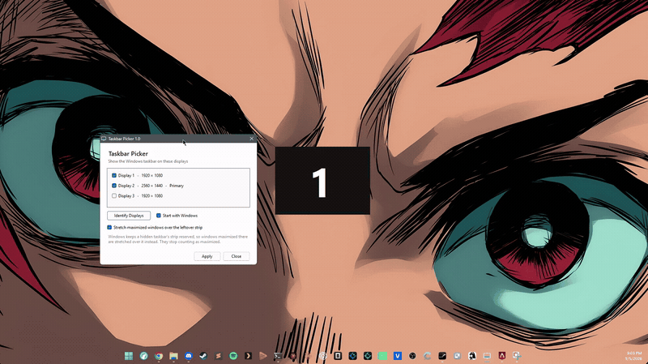
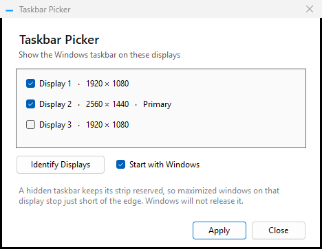

# Taskbar Picker

Windows 11 gives you two choices: taskbar on **one** display, or on **all** of them.

Got three monitors and want the taskbar on just two? Tough luck. That's what this fixes.

## Get it running

1. Download this repo (green **Code** button → **Download ZIP**) and unzip it
2. Double-click **`build.cmd`**, it takes about a second
3. Run **`bin\taskbarpick.exe`**

No installer and nothing to download beforehand: step 2 uses the C# compiler that is already
part of Windows, so there is no SDK, no runtime, no dependencies. You end up with one 24KB app.

You build it yourself on purpose. A downloaded binary from a stranger is unsigned, so Windows
SmartScreen blocks it and you have to click through the warning to trust something you cannot
read. This way the only thing you download is source you can look at first.

## Using it

Tick the displays that should have a taskbar, click **Apply**. Done.

- **Identify Displays** flashes a big number on each screen, so you know which is which
- **Start with Windows** brings it back automatically after a reboot
- It lives in the system tray. Double-click the icon to change your picks
- Tray menu → **Exit** puts every taskbar back exactly as it was

The very first time you turn a taskbar on or off for a non-primary display, Windows needs
Explorer restarted to do it. The app asks first, it takes about a second, and any File Explorer
windows you have open will close.

## That last checkbox

**Stretch maximized windows over the leftover strip**

When a taskbar is hidden, Windows still holds onto its 48px slice of that screen, so maximized
windows stop just short of the bottom and you see a wallpaper stripe.

Leave this ticked and windows maximized on those displays get stretched over the stripe, using
the whole screen. The catch: such a window stops counting as "maximized", so its restore button
won't snap it back to its old size. Untick it and everything goes back to normal.

## If a taskbar is missing and the app is gone

Hiding a taskbar lasts as long as Windows keeps that taskbar window hidden. Quitting through the
tray menu restores everything, but if the app is killed instead (Task Manager, a crash, an update
that takes the process down), the taskbar stays hidden and there is no tray icon left to fix it.

Two ways back:

- Start `taskbarpick.exe` again and use the tray menu → **Exit**
- Or Ctrl+Shift+Esc → find **Windows Explorer** → **Restart**

## Notes

No hooks, no injection, no background services, nothing loaded into other programs.

MIT licensed, see [LICENSE](LICENSE). Built and used on Windows 11.
